# Robotic Arm Project


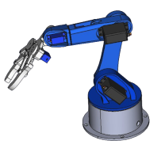

Welcome to the Robotic Arm Project! This project involves the design and development of a 5-axis robotic arm, which includes both 3D printed components and firmware for control via an ESP32 development board.

## Table of Contents

- [Overview](#overview)
- [Hardware Setup](#hardware-setup)
- [Software Setup](#software-setup)
- [Usage](#usage)
- [Image Gallery](#image-gallery)
- [YouTube Video](#youtube-video)

## Overview

This project is divided into two main parts:

- **3D Models**: The parts required to 3D print the robotic arm.
- **Firmware**: The code required to control the robotic arm via an ESP32 development board.

## Hardware Setup

### Required Components

- ESP32 development board (esp32doit-devkit-v1)
- MG996R servos (3 units)
- SG90 servos (3 units)
- Power supply for servos (USB 5V)
- 3D printed parts (refer to the `3d` directory)

### Connections

- **Servo 1**: GPIO 13
- **Servo 2**: GPIO 12
- **Servo 3**: GPIO 14
- **Servo 4**: GPIO 27
- **Servo 5**: GPIO 26
- **Servo 6**: GPIO 25

## Software Setup

### Prerequisites

- [Visual Studio Code](https://code.visualstudio.com/)
- [PlatformIO IDE](https://platformio.org/install/ide?install=vscode)

### Steps

1. **Clone the repository**:

   ```bash
   git clone https://github.com/cesariohomens/RoboticArm.git
   cd RoboticArm/firmware
   ```
2. **Open the project in VSCode**:

   ```bash
   code .
   ```
3. **Build and upload the firmware**:

   - Connect the ESP32 to your computer.
   - Use PlatformIO to build and upload the firmware to the ESP32.

## Usage

1. **Power on the ESP32**: After flashing, the ESP32 will start and set up a WiFi Access Point.
2. **Connect to the WiFi**:
   - SSID: `robotic_arm`
   - Password: `robot123`
3. **Control the arm**:
   - Open a web browser and navigate to `http://192.168.3.1`.
   - Use the web interface to control the servos of the robotic arm.
     

## Image Gallery

Here are step-by-step images to help you visualize the assembly process of the robotic arm:

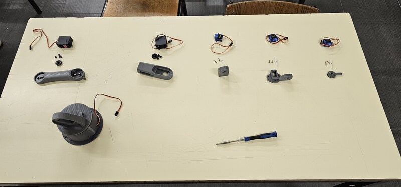
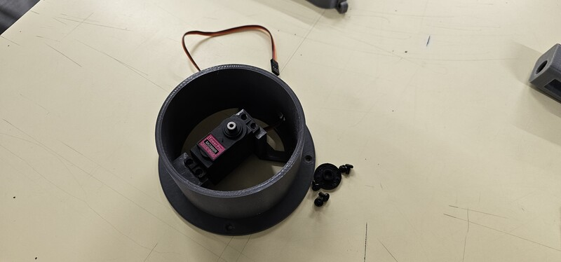
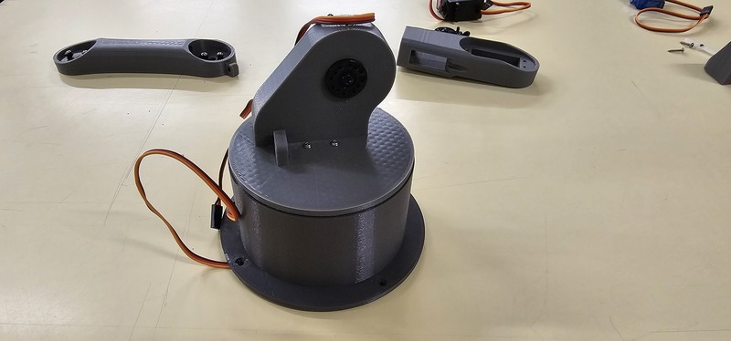
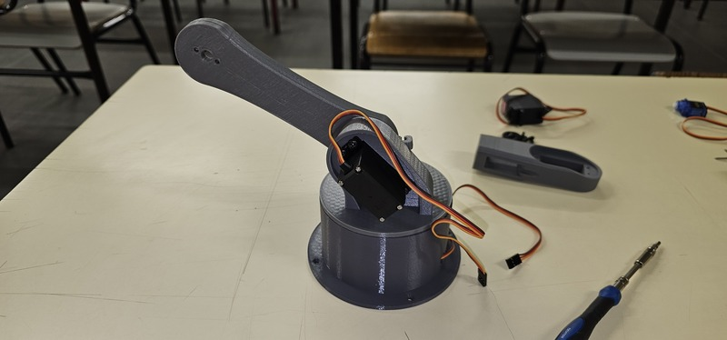
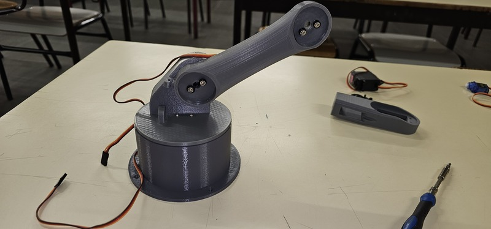
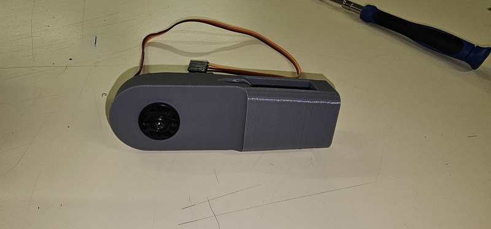
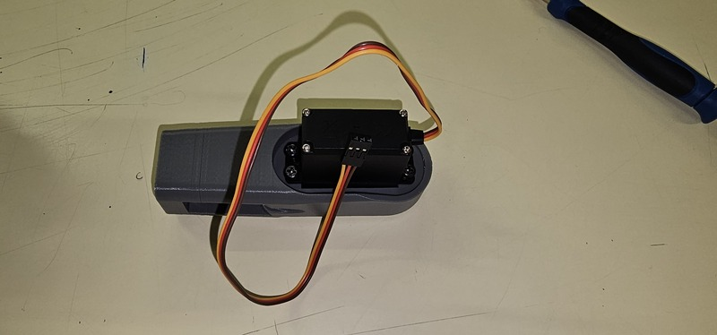
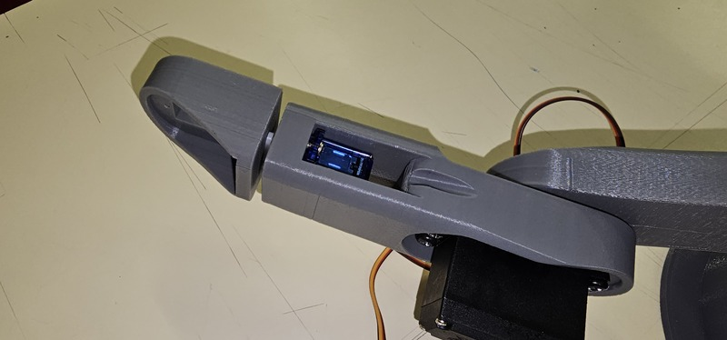
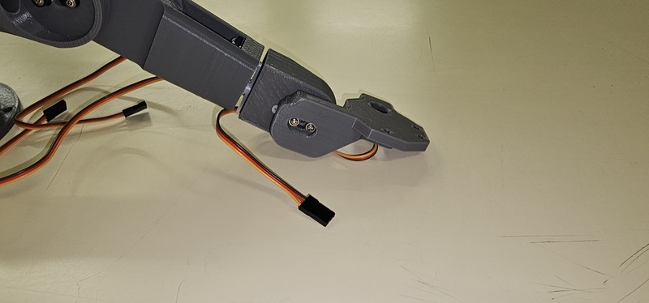
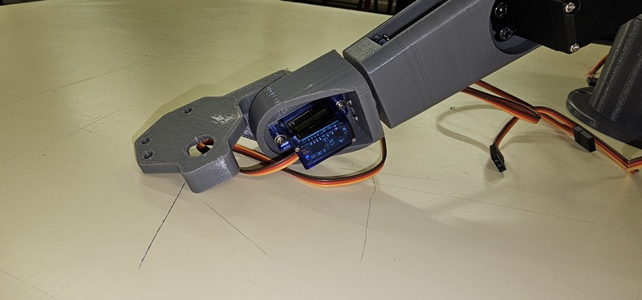
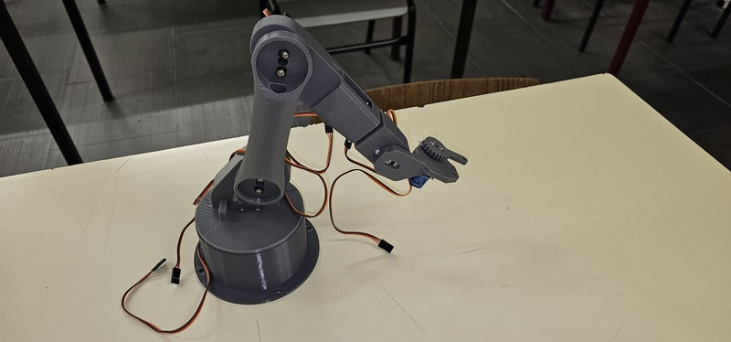
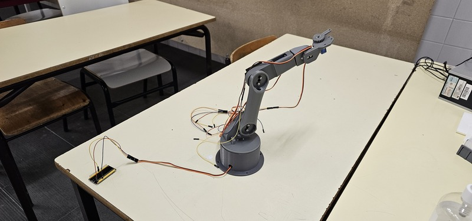
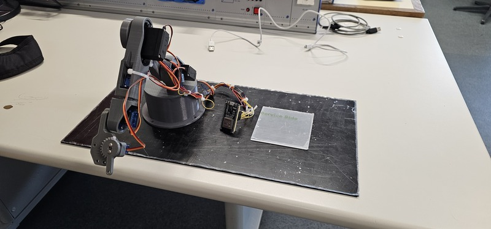
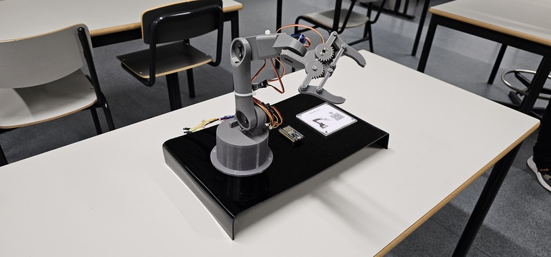
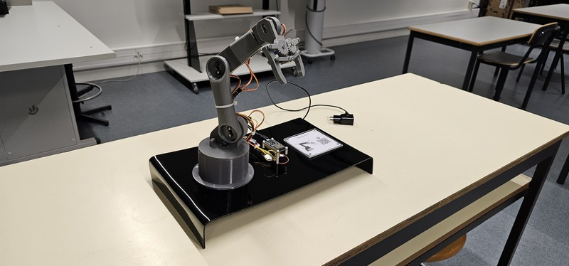

## YoutTube Video

[](http://www.youtube.com/watch?v=zhQYO_a90Ds)
